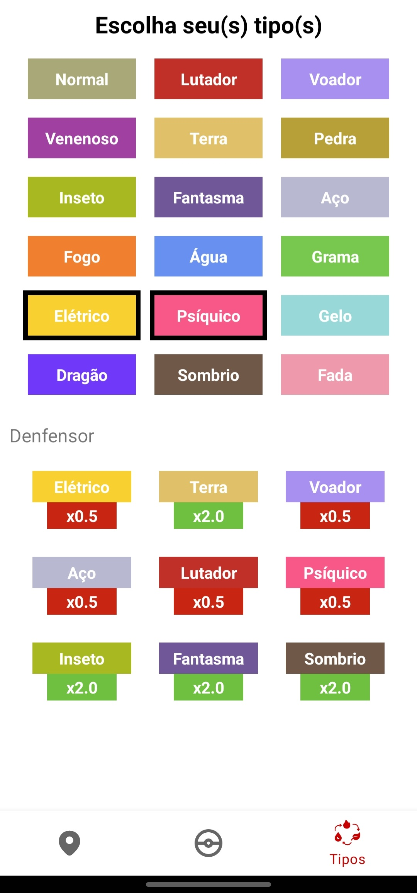

Pokedex App
====================================

Esse é um App de Pokedex que permite que o usuário navegue por todos os Pokemon existentes na [PokeAPI](https://pokeapi.co/), e possa visualizar diversas características acerca desses Pokemon. O usuário que a aplicação atende são pessoas que jogam os jogos da franquia, ou que são simplesmente fãs, e gostam de saber mais sobre as características e curiosidades dos monstrinhos.

## Versão
O App foi desenvolvido utilizando para a versão [Android Oreo](https://developer.android.com/about/versions/oreo) (8.0), e que utiliza o Sdk versão 26. Com isso todas as versões superiores à essa do Android suportam a aplicação.

## Funcionalidades
O App tem uma navegação em barra inferior, com três telas principais, que representam as principais funcionalidades do App, sendo elas a tela Home, que exibe os Pokemon e suas informaçoes, a tela Tipos, que contém a calculadora de tipos, e por fim a tela Regiões, que mostrar as regiões e localidades, assim como os Pokemon que aparecem nelas.

 - ### Visualizar lista de Pokemon
    Essa tela é a principal tela do App, onde ele é iniciado assim que o usuário o abre. No topo da tela existe uma ferramenta de busca, e logo abaixo um grid com todos os Pokemon. Detalhando mais o grid de Pokemon, ele possui um scroll infinito, ou seja, a medida que o usuário vai descendo e vendo mais Pokemon, o App, automaticamente vai fazendo mais requests para API e carregando novos Pokemon, a paginação está definida para 30 Pokemon por vez a serem exibidos. Nesse grid, é possível que o usuário clique em algum Pokemon de seu interesse, indo assim para um tela onde ele visualiza aquele Pokemon de forma detalhada. A ferramenta de busca também presente nesta tela serve para que o usuário pesquise um determinado Pokémon por nome ou pelo seu id (de acordo com a [PokeAPI](https://pokeapi.co/)), se a busca não resultar em nada, nada acontecerá, mas, se algum Pokemon for encontrado, ele é exibido na tela para o usuário, nessa situação, para que o usuário consiga ver a lista de Pokemon novamente, ele clica no botão de pesquisar novamente com o campo de busca vazio.
			
    | Tela Home   | Tela Home com busca |
    |:--------:|:--------:|
    |  |  | 

    
 - ### Visualizar características de Pokemon
    Após o usuário clicar em um Pokemon, ele é redirecionado para essa tela, nela, ele consegue ver diversas informações interessantes acerca do Pokemon. De cima para baixo, primeiro existe um dropdown onde ele consegue selecionar a variante desse Pokemon, por padrão a variante carregada inicialmente é a principal, ao selecionar outra variante do Pokemon, suas informações são exibidas na tela. Depois temos a imagem, tipos, e gênero do Pokemon, essa imagem pode ser mudada clicando no botão de shiny (umas estrelinhas ao lado da imagem) e nos botões de gênero (caso o Pokemon tenha apenas um gênero, só ele será exibido, se o Pokemon não tiver gênero, esses botões não estarão disponíveis), variando assim a imagem do Pokemon, para o gênero selecionado e se é sua versão shiny ou não. Um pouco mais abaixo, existem as informações dos stats do Pokemon, isso é apenas para visualização. Depois é exibido toda a lista evolutiva do Pokemon, em que o usuário pode clicar nas outras evoluções e visualizar suas informações. Por fim estão os tipos que o Pokemon é resistente ou fraco contra, juntamente com os multiplicadores, os multiplicadores funcionam da seguinte forma: x0 imune, x0,5 recebe metade do dano, x1 recebe o dano normalmente, x2 ou x4 recebe o dano multiplicado por 2 ou 4 respectivamente.
    
    | Tela Informações do Pokemon |
    |:--------:|
    |  |
    
 - ### Calculadora de tipos
    O usuário é capaz de selecionar até dois tipos, ao selecionar pelo menos um, é exibido uma lista de quais tipos essa combinação é fraca ou forte. Na Lista de Defender, os tipos são exibidos como se um Pokemon com a combinação selecionada estivesse defendendo ataques dos tipos mostrados, ou seja, se for exibido que determinado tipo é x2, ele dá o dobro de dano na combinação de tipos escolhida, se for x0.5, o tipo dá metade do dano na combinação escolhida, e assim por diante. A lista de Attacker só é exibida se o usuário selecionar apenas um tipo, e ela exibe o multiplicador de dano que esse tipo dá em outros, ou seja, caso apareça x2, ele dá duas vezes mais dano no tipo que for exibido. A calculadora de tipos tem base nas relações de tipos mais atuais, contendo todos os tipos atualmente presente nos jogos de Pokemon.
    
    | Tela Calculadora de Tipos   | Tela Calculadora de Tipos com 1 selecionado | Tela Calculadora de Tipos com 2 selecionados |
    |:--------:|:--------:|:--------:|
    |  |  |  |

 - ### Pokemon de cada região
    O usuário pode navegar pelas diferentes regiões e localidades dos jogos da franquia Pokemon, e visualizar quais Pokemon podem ser encontrados nelas. Também é possível abrir os detalhes dos Pokemon exibidos nessas localidades.
    
    | Tela Regiões | Tela Regiões com Kanto selecionado | Tela Regiões com Kanto e Route 1 selecionado | Tela Regiões com Kanto, Route 1 e Route 1 area selecionado |
    |:--------:|:--------:|:--------:|:--------:|
    |  |  |  |  |
    
## Particularidades

 - ### Funcionalidades
    Além de funcionar como um aplicativo padrão de Pokedex, ou seja, exibir a lista de todos Pokemon e suas características, nesse App, há uma calculadora de tipos de fácil uso. Seu uso é bem mais prático do que os gráficos de tipo, que são comumente usados por jogadores da franquia Pokemon. Também está presente uma visualização de Pokemon por regiões e localidades, o que permite um usuário ver quais Pokemon podem aparecer em determinadas regiões do jogo.

 - ### Técnicas
    Todo o App foi desenvolvido com base nas informações presentes na [PokeAPI](https://pokeapi.co/), então necessitamos que as informações lá estejam corretas para que o que é exibido na aplicação esteja correto. Com isso tivemos algumas implicações, como no sistema de busca que para buscar, o usuário deve digitar exatamente o nome do Pokemon.

    Um recurso interessante que adotamos para tirar um pouco a dependência da API, e até mesmo da conexão com a internet, é que todos os dados sobre Pokemon são salvos em um banco de dados local no celular do usuário, então, quanto mais o usuário navega e utiliza o App, mais esse banco de dados fica completo, e caso ele não consiga se conectar à internet ou à API, o App continua funcionando exibindo as informações que ele já viu anteriormente, salvo as imagens que necessariamente precisam de conexão com a internet para serem carregadas.

## Instalação
Para utilizar o App, basta clonar o repositório e abrir a pasta no [Android Studio](https://developer.android.com/studio), nele você conseguirá executar o App em um emulador da própria IDE, no seu celular (conectando com a opção de debug) ou gerar o Apk para instalação direto am qualquer aparelho Android.
